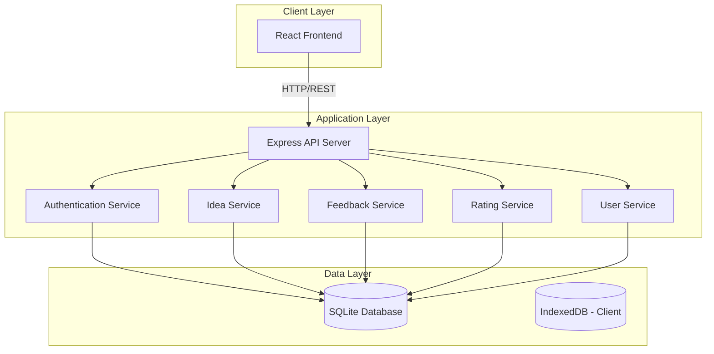

# Design Document: Creative Ideas Platform

## Overview

The Creative Ideas Platform is a web-based application that facilitates community-driven knowledge exchange through idea sharing, feedback, and ratings. The system follows a three-tier architecture with a presentation layer (frontend), application layer (backend API), and data layer (database).

### Technology Stack

- **Frontend**: React with TypeScript for type safety and component-based UI
- **Backend**: Node.js with Express for RESTful API
- **Database**: SQLite for lightweight relational data storage
- **Client Storage**: IndexedDB for offline-capable client-side data caching
- **Authentication**: JWT (JSON Web Tokens) for stateless authentication
- **Password Security**: bcrypt for password hashing

## Architecture



### Design Principles

1. **Separation of Concerns**: Clear boundaries between presentation, business logic, and data access
2. **RESTful API Design**: Standard HTTP methods and status codes for predictable interactions
3. **Stateless Authentication**: JWT tokens for scalable authentication without server-side sessions
4. **Data Integrity**: Database constraints and application-level validation to ensure data quality
5. **Real-time Updates**: Efficient data fetching to display current engagement metrics

## Components and Interfaces

### Frontend Components

#### Authentication Components
- **RegistrationForm**: Captures username, email, and password for new user registration
- **LoginForm**: Authenticates existing users with email and password
- **AuthContext**: React context for managing authentication state across the application

#### Idea Components
- **IdeaSubmissionForm**: Interface for creating new ideas with title and description
- **IdeaList**: Displays paginated list of all ideas with summary information
- **IdeaDetail**: Shows complete idea information including feedback and ratings
- **IdeaCard**: Reusable component displaying idea summary with engagement metrics

#### Feedback Components
- **FeedbackForm**: Text input for submitting feedback on an idea
- **FeedbackList**: Displays all feedback for a specific idea with author and timestamp
- **FeedbackItem**: Individual feedback display component

#### Rating Components
- **RatingInput**: Interactive 1-5 star rating interface
- **RatingDisplay**: Shows average rating and total rating count

#### User Components
- **UserProfile**: Displays user information and their submitted ideas
- **ProfileEditor**: Form for updating user profile information

### Backend API Endpoints

#### Authentication Endpoints
```
POST /api/auth/register
  Body: { username, email, password }
  Response: { user, token }

POST /api/auth/login
  Body: { email, password }
  Response: { user, token }

GET /api/auth/me
  Headers: { Authorization: Bearer <token> }
  Response: { user }
```

#### Idea Endpoints
```
POST /api/ideas
  Headers: { Authorization: Bearer <token> }
  Body: { title, description }
  Response: { idea }

GET /api/ideas
  Query: { page, limit, sortBy }
  Response: { ideas[], totalCount, page, totalPages }

GET /api/ideas/:id
  Response: { idea, feedback[], averageRating, ratingCount }

GET /api/users/:userId/ideas
  Response: { ideas[] }
```

#### Feedback Endpoints
```
POST /api/ideas/:ideaId/feedback
  Headers: { Authorization: Bearer <token> }
  Body: { content }
  Response: { feedback }

GET /api/ideas/:ideaId/feedback
  Response: { feedback[] }
```

#### Rating Endpoints
```
POST /api/ideas/:ideaId/ratings
  Headers: { Authorization: Bearer <token> }
  Body: { score }
  Response: { rating }

PUT /api/ideas/:ideaId/ratings
  Headers: { Authorization: Bearer <token> }
  Body: { score }
  Response: { rating }

GET /api/ideas/:ideaId/ratings/average
  Response: { averageRating, count }
```

#### User Endpoints
```
GET /api/users/:id
  Response: { user, ideaCount, feedbackCount }

PUT /api/users/:id
  Headers: { Authorization: Bearer <token> }
  Body: { username, email }
  Response: { user }
```

### Service Layer

#### AuthenticationService
- `register(username, email, password)`: Creates new user account with hashed password
- `login(email, password)`: Validates credentials and generates JWT token
- `verifyToken(token)`: Validates JWT and returns user information
- `hashPassword(password)`: Uses bcrypt to hash passwords
- `comparePassword(password, hash)`: Verifies password against stored hash

#### IdeaService
- `createIdea(userId, title, description)`: Creates and stores new idea
- `getIdeas(page, limit, sortBy)`: Retrieves paginated list of ideas
- `getIdeaById(ideaId)`: Retrieves single idea with full details
- `getUserIdeas(userId)`: Retrieves all ideas by specific user
- `getIdeaWithEngagement(ideaId)`: Retrieves idea with feedback and rating metrics

#### FeedbackService
- `createFeedback(userId, ideaId, content)`: Creates feedback entry
- `getFeedbackByIdea(ideaId)`: Retrieves all feedback for an idea
- `validateFeedbackOwnership(userId, ideaId)`: Ensures user is not providing feedback on own idea

#### RatingService
- `createRating(userId, ideaId, score)`: Creates new rating
- `updateRating(userId, ideaId, score)`: Updates existing rating
- `getAverageRating(ideaId)`: Calculates average rating for an idea
- `getRatingCount(ideaId)`: Counts total ratings for an idea
- `validateRatingOwnership(userId, ideaId)`: Ensures user is not rating own idea

#### UserService
- `getUserById(userId)`: Retrieves user information
- `updateUser(userId, updates)`: Updates user profile
- `getUserStats(userId)`: Retrieves user activity statistics

## Data Models

### User Model
```typescript
interface User {
  id: string;              // UUID primary key
  username: string;        // Unique, 3-30 characters
  email: string;           // Unique, valid email format
  passwordHash: string;    // bcrypt hashed password
  createdAt: Date;         // Account creation timestamp
  updatedAt: Date;         // Last profile update timestamp
}
```

### Idea Model
```typescript
interface Idea {
  id: string;              // UUID primary key
  userId: string;          // Foreign key to User
  title: string;           // 5-100 characters
  description: string;     // 10-5000 characters
  createdAt: Date;         // Submission timestamp
  updatedAt: Date;         // Last modification timestamp
}
```

### Feedback Model
```typescript
interface Feedback {
  id: string;              // UUID primary key
  ideaId: string;          // Foreign key to Idea
  userId: string;          // Foreign key to User
  content: string;         // Minimum 10 characters
  createdAt: Date;         // Feedback submission timestamp
}
```

### Rating Model
```typescript
interface Rating {
  id: string;              // UUID primary key
  ideaId: string;          // Foreign key to Idea
  userId: string;          // Foreign key to User
  score: number;           // Integer 1-5
  createdAt: Date;         // Initial rating timestamp
  updatedAt: Date;         // Last rating update timestamp
}
```

### Database Schema (SQLite)

```sql
-- Users table
CREATE TABLE users (
  id TEXT PRIMARY KEY,  -- UUID stored as TEXT
  username TEXT UNIQUE NOT NULL CHECK(length(username) >= 3 AND length(username) <= 30),
  email TEXT UNIQUE NOT NULL,
  password_hash TEXT NOT NULL,
  created_at TEXT DEFAULT (datetime('now')),
  updated_at TEXT DEFAULT (datetime('now'))
);

-- Ideas table
CREATE TABLE ideas (
  id TEXT PRIMARY KEY,  -- UUID stored as TEXT
  user_id TEXT NOT NULL,
  title TEXT NOT NULL CHECK(length(title) >= 5 AND length(title) <= 100),
  description TEXT NOT NULL CHECK(length(description) >= 10),
  created_at TEXT DEFAULT (datetime('now')),
  updated_at TEXT DEFAULT (datetime('now')),
  FOREIGN KEY (user_id) REFERENCES users(id) ON DELETE CASCADE
);

-- Feedback table
CREATE TABLE feedback (
  id TEXT PRIMARY KEY,  -- UUID stored as TEXT
  idea_id TEXT NOT NULL,
  user_id TEXT NOT NULL,
  content TEXT NOT NULL CHECK(length(content) >= 10),
  created_at TEXT DEFAULT (datetime('now')),
  FOREIGN KEY (idea_id) REFERENCES ideas(id) ON DELETE CASCADE,
  FOREIGN KEY (user_id) REFERENCES users(id) ON DELETE CASCADE
);

-- Ratings table
CREATE TABLE ratings (
  id TEXT PRIMARY KEY,  -- UUID stored as TEXT
  idea_id TEXT NOT NULL,
  user_id TEXT NOT NULL,
  score INTEGER NOT NULL CHECK(score >= 1 AND score <= 5),
  created_at TEXT DEFAULT (datetime('now')),
  updated_at TEXT DEFAULT (datetime('now')),
  UNIQUE(idea_id, user_id),
  FOREIGN KEY (idea_id) REFERENCES ideas(id) ON DELETE CASCADE,
  FOREIGN KEY (user_id) REFERENCES users(id) ON DELETE CASCADE
);

-- Indexes for performance
CREATE INDEX idx_ideas_user_id ON ideas(user_id);
CREATE INDEX idx_ideas_created_at ON ideas(created_at DESC);
CREATE INDEX idx_feedback_idea_id ON feedback(idea_id);
CREATE INDEX idx_ratings_idea_id ON ratings(idea_id);

-- Triggers to prevent self-feedback and self-rating
CREATE TRIGGER prevent_self_feedback
BEFORE INSERT ON feedback
BEGIN
  SELECT CASE
    WHEN NEW.user_id = (SELECT user_id FROM ideas WHERE id = NEW.idea_id)
    THEN RAISE(ABORT, 'Cannot provide feedback on own idea')
  END;
END;

CREATE TRIGGER prevent_self_rating
BEFORE INSERT ON ratings
BEGIN
  SELECT CASE
    WHEN NEW.user_id = (SELECT user_id FROM ideas WHERE id = NEW.idea_id)
    THEN RAISE(ABORT, 'Cannot rate own idea')
  END;
END;
```

### IndexedDB Schema (Client-Side)

IndexedDB will be used for caching data on the client side to enable offline viewing and improve performance.

```typescript
// Database name: CreativeIdeasDB
// Version: 1

// Object Stores:

// 1. ideas store
{
  keyPath: 'id',
  indexes: [
    { name: 'userId', keyPath: 'userId', unique: false },
    { name: 'createdAt', keyPath: 'createdAt', unique: false }
  ]
}

// 2. feedback store
{
  keyPath: 'id',
  indexes: [
    { name: 'ideaId', keyPath: 'ideaId', unique: false }
  ]
}

// 3. ratings store
{
  keyPath: 'id',
  indexes: [
    { name: 'ideaId', keyPath: 'ideaId', unique: false }
  ]
}

// 4. users store (cached user profiles)
{
  keyPath: 'id',
  indexes: []
}

// 5. syncQueue store (for offline operations)
{
  keyPath: 'id',
  autoIncrement: true,
  indexes: [
    { name: 'timestamp', keyPath: 'timestamp', unique: false }
  ]
}
```

### Client-Side Storage Strategy

1. **Caching**: Store fetched ideas, feedback, and ratings in IndexedDB for quick access
2. **Offline Support**: Queue operations when offline and sync when connection is restored
3. **Cache Invalidation**: Refresh cached data periodically or on user action
4. **Sync Queue**: Track pending operations (create idea, submit feedback, rate) for offline mode

## Error Handling

### Error Response Format
All API errors follow a consistent format:
```typescript
interface ErrorResponse {
  error: {
    code: string;          // Machine-readable error code
    message: string;       // Human-readable error message
    details?: any;         // Optional additional error context
  }
}
```

### Error Categories

#### Authentication Errors (401)
- `AUTH_INVALID_CREDENTIALS`: Email or password is incorrect
- `AUTH_TOKEN_MISSING`: No authentication token provided
- `AUTH_TOKEN_INVALID`: Token is malformed or expired
- `AUTH_TOKEN_EXPIRED`: Token has exceeded its validity period

#### Authorization Errors (403)
- `FORBIDDEN_SELF_FEEDBACK`: User attempted to provide feedback on own idea
- `FORBIDDEN_SELF_RATING`: User attempted to rate own idea
- `FORBIDDEN_RESOURCE`: User lacks permission to access resource

#### Validation Errors (400)
- `VALIDATION_FAILED`: Request data failed validation rules
- `INVALID_EMAIL`: Email format is invalid
- `INVALID_PASSWORD`: Password does not meet security requirements
- `INVALID_RATING`: Rating score outside 1-5 range
- `CONTENT_TOO_SHORT`: Content does not meet minimum length

#### Resource Errors (404)
- `USER_NOT_FOUND`: Requested user does not exist
- `IDEA_NOT_FOUND`: Requested idea does not exist
- `FEEDBACK_NOT_FOUND`: Requested feedback does not exist

#### Conflict Errors (409)
- `USER_EXISTS`: Username or email already registered
- `RATING_EXISTS`: User has already rated this idea (use PUT to update)

#### Server Errors (500)
- `INTERNAL_ERROR`: Unexpected server error occurred
- `DATABASE_ERROR`: Database operation failed

### Error Handling Strategy

1. **Input Validation**: Validate all inputs at API boundary before processing
2. **Database Constraints**: Rely on database constraints as final validation layer
3. **Graceful Degradation**: Return partial data when possible rather than complete failure
4. **Error Logging**: Log all errors with context for debugging and monitoring
5. **User-Friendly Messages**: Provide clear, actionable error messages to users

## Testing Strategy

### Unit Testing

#### Backend Unit Tests
- **Service Layer Tests**: Test business logic in isolation with mocked dependencies
  - Authentication service: password hashing, token generation, validation
  - Idea service: CRUD operations, validation logic
  - Feedback service: creation, ownership validation
  - Rating service: score calculation, average computation
  - User service: profile operations, statistics calculation

- **Utility Function Tests**: Test helper functions and validators
  - Email validation
  - Password strength validation
  - Input sanitization

#### Frontend Unit Tests
- **Component Tests**: Test React components in isolation
  - Form validation and submission
  - Conditional rendering based on props
  - Event handler execution
  - State management

- **Hook Tests**: Test custom React hooks
  - Authentication state management
  - Data fetching hooks
  - Form handling hooks

### Integration Testing

#### API Integration Tests
- **Authentication Flow**: Complete registration and login workflows
- **Idea Lifecycle**: Create, retrieve, update idea with associated data
- **Feedback Flow**: Submit feedback and verify storage and retrieval
- **Rating Flow**: Submit and update ratings, verify average calculation
- **Authorization**: Verify permission checks prevent unauthorized actions

#### Database Integration Tests
- **Constraint Validation**: Verify database constraints enforce data integrity
- **Cascade Operations**: Test deletion cascades work correctly
- **Transaction Handling**: Verify rollback on errors

### End-to-End Testing

#### User Workflows
- **New User Journey**: Register → Login → Submit Idea → View Ideas
- **Engagement Journey**: Login → Browse Ideas → Provide Feedback → Rate Idea
- **Profile Journey**: Login → View Profile → Edit Profile → View Own Ideas

#### Cross-Browser Testing
- Test on Chrome, Firefox, Safari, Edge
- Verify responsive design on mobile and desktop viewports

### Performance Testing

#### Load Testing
- Simulate concurrent users accessing the platform
- Test database query performance with large datasets
- Verify API response times under load

#### Optimization Targets
- API response time < 200ms for simple queries
- Page load time < 2 seconds
- Database queries optimized with appropriate indexes

### Security Testing

#### Authentication Security
- Verify password hashing with bcrypt
- Test JWT token expiration and validation
- Verify protection against brute force attacks

#### Authorization Security
- Test that users cannot access unauthorized resources
- Verify ownership checks prevent cross-user data manipulation
- Test SQL injection prevention

#### Input Validation
- Test XSS prevention through input sanitization
- Verify all inputs are validated before processing
- Test boundary conditions for all input fields

## Deployment Considerations

### Environment Configuration
- Separate configurations for development, staging, and production
- Environment variables for sensitive data (database credentials, JWT secret)
- CORS configuration for frontend-backend communication

### Database Migration Strategy
- Use migration tools (e.g., better-sqlite3 with custom migration scripts) for schema changes
- Version control all migration scripts
- SQLite database file stored in project directory for development
- Test migrations before deployment

### Monitoring and Logging
- Application logging for errors and important events
- Database query performance monitoring
- API endpoint response time tracking
- User activity analytics

### Scalability Considerations
- Stateless API design enables horizontal scaling
- SQLite suitable for small to medium-scale deployments
- IndexedDB provides client-side caching to reduce server load
- Offline-first architecture reduces server dependency
- CDN for static frontend assets
- Consider migration to PostgreSQL/MySQL for large-scale production deployments
